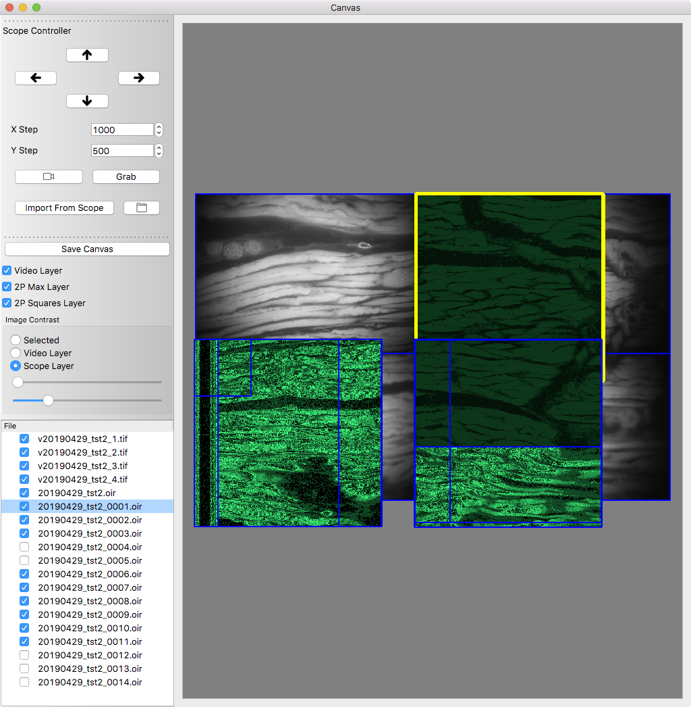

## Canvas

Canvas is a pure python application allowing images from two different light paths on a microscope to be visual/spatially displayed in an interactive canvas

## Screenshots

Example Canvas interface. This is another bad example, keep in tune as it will get better.

<!--  -->


## To Do

Write code to properly save tiff tags in video so we can then read them (use tifffile)
 
see here for code to do proper contrast adjustment

```
https://stackoverflow.com/questions/14464449/using-numpy-to-efficiently-convert-16-bit-image-data-to-8-bit-for-display-with
```

only available in Qt>=5.13, QtGui.QImage.Format_Grayscale16

this generally works, need to check bit depth of video images
```
image_stack = skimage.img_as_ubyte(image_stack, force_copy=False)
```

### todo notes

1) load as qimage (keep copy),
2) adjust brightness, second copy,
3) insert brightness adjusted into QPixmap/myGraphicsPixMapItem

