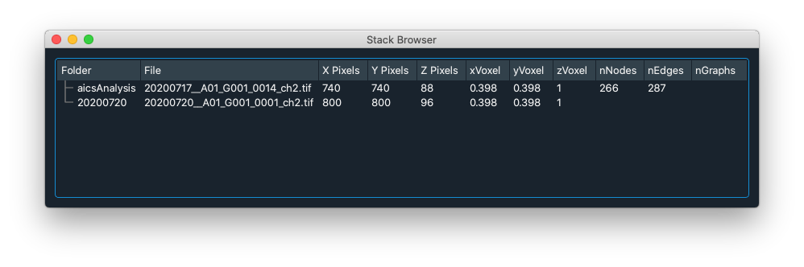
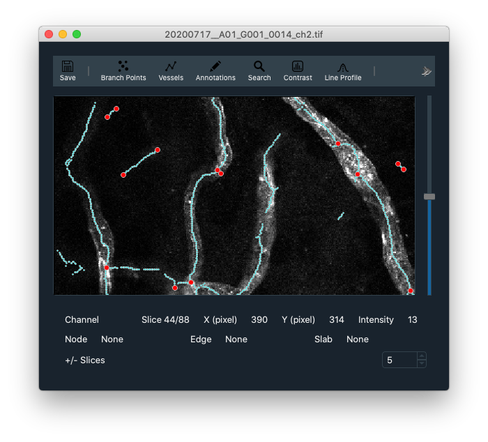

## bImPy Interface

### Stack Browser

### Stack

#### Editing

a + Click, Add an annotation
Shift + Click, Add a branch point
e + click, Add an edge (New edge will go from selected node to clicked position or connect to another existing branch point)

left-click, Select an object
Del, delete selected object

#### Keyboard

| Keyboard | Right-Click Menu | Action                      |
| -------- | ---------------- | --------------------------- |
| 1/2/3    |                  | View Image Color Channel    |
|          | rgb              | View multichannel RGB Image |
| c        | Contrast         | Toggle Image Contrast Panel |
| l        | Line Profile     | Line Profile                |
|          |                  |                             |
