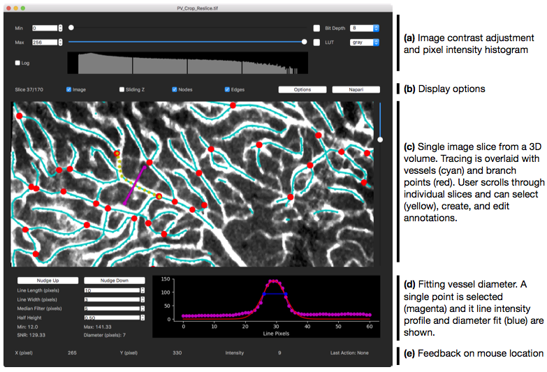
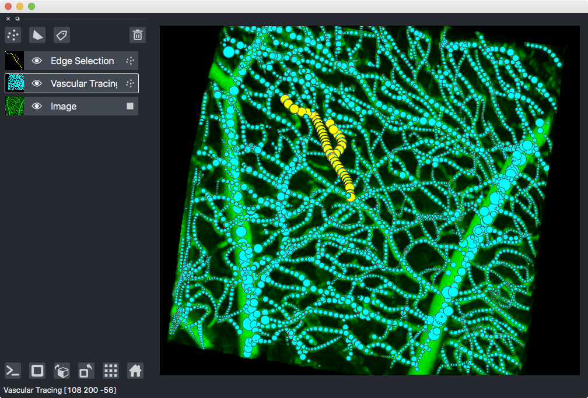
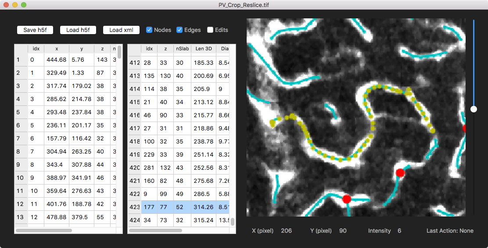

## bImPy

**bImPy** is a multi-dimensional image viewer and annotation tool built with Python using Qt for the interface. **bImPy** should be pronounced 'bimpee' but you can call it whatever you want.

We are currently using **bImPy** to visualize and edit vascular tracing that are semi-automatically generated by [Vesselucida][vesselucida](MBF) and [DeepVess][deepvess].

**bImPy** will eventually replace our flagship spine tracking software [Map Manager][mapmanager] and [PyMapManager][pymapmanager].

The roadmap is that by providing highly interactive 3D image volume (and time-series) visualization integrated with precise editing of annotations, **bImPy** will be able to leverage the ever growing automatic tracing that uses artificial intelligence (AI). Although AI is great, it always comes with an unknown error rate. For many biological image analysis tasks, error is not acceptible and the analysis must aproach the ground truth. With **bImPy** we hope to acheive this.


## Disclaimer

We are developing **bImPy** in the open but the project is still in an early alpha stage and there will be **breaking changes** with each release. Please follow along as we develop this exciting new software and feel free to try it out and contribute ideas and code.

## Screenshots

**Figure 1. Stack window with a vascular tracing.** **(a)** Control image contrast with sliders and a pixel intensity histogram. **(b)** The current slice and interface to toggle different aspects of the tracing. **(c)** Image (grayscale) and annotation/tracing interface. This is a 3D .tif stack looking at one image slice with the tracing overlaid. The tracing includes vessels (cyan), branch points (red), a vessel selection specified by the user (yellow), and a single point selection with an automatically drawn line to measure diameter (megenta). **(d)** Each point in the tracing has an automatically generated perpendicular line (megenta) and the line intensity profile is used to automatically generated best fits for diameter (blue). **(e)** Feedback on mouse position and pixel intensity as well as the last annotation edit.

<!--  -->



**Figure 2. Stack window using the 3D Napari viewer.** bImPy is also using the excellent 3D visualization tool [Napari][napari]. Here is a Napari 3D view of the image volume (green) with tracing (cyan) and a user selection (yellow).



**Figure 3. Stack window using interactive and sortable annotation lists.** Because tracings usually get large with more than 10,000 individual points and many hundreds of vessel segments, it is often useful to have a list of annotation objects. In this screenshot, we have a list of branch points (1st list) and vessel segments (2nd list). Selecting an annotation from a list or in the image will highlight that annotation in all other views. Each annotation in the lists is analyzed and the list can be sorted by, for example, vessel length. Here, we have selected a longer vessel with length of 314.26 (Len 3D) in the list and it is selected in the image (yellow).




## Download, Install, Run ...

We assume you have the following installed on your computer:

- [python 3.7.x](https://www.python.org/downloads/)
- [git](https://git-scm.com/downloads)
- [pip](https://pip.pypa.io/en/stable/installing/)
- [venv](https://docs.python.org/3/library/venv.html)

### 1) Clone the github repository with git

```
git clone https://github.com/cudmore/bImPy.git
```

This will make a folder named `bImPy`, we will use that for the rest of the install.

### 2) Install

Make sure you change into the `bImPy` directory

```
cd bImPy
```

#### Mac OS and Linux

If you are using macOS High Sierra (10.13) or later and/or Linux, use our premade install scripts.

```
./install
```

#### Manual install including Windows 7/10

Assuming you have `venv` and `pip`

```
cd bImPy

# create a virtual environment in folder 'bImPy_env'
python3 -m venv bImPy_env

# activate the virtual environment
source bImPy_env/bin/activate 

# install napari first, makes life easier
#pip install napari

# install requirements
pip install -r requirements.txt

# install bImPy, The '-e' allows editing of the installed package code
pip install -e .
```

### 3) Run

#### If you installed with our premade macOS and/or Linux scripts

```
./run
```

#### If you installed manually or on Windows 7/10

```
source bImPy_env/bin/activate
python bimpy/interface/bStackBrowser.py
```

## Troubleshooting

Qt for Python is a very confusing ecosystem. We are following the lead of the Napari developers and using PySide2 and QtPy. We are not using PyQt5? Our pip freeze looks like this:

```
# mac os sierra
napari==0.2.11
PySide2==5.13.2
QtPy==1.9.0
```

### macOS version

If using macOS Sierra (10.12), PyQt==5.13.0 needs to be used.

### bImPy should be used with .tif files

bImPy is currently designed to load .tif files only. We are working on a version that will load commercial microscope formats and have started implementing this for Olympus .oir files.

This makes heavy use of [Python bio-formats][python-bio-formats] which in itself is excellent and is used by [Fiji][fiji]. Regrettably, bio-formats uses Java and requires the Python package [javabridge][javabridge]. If you run into problems installing or using bImPy, it is probably due to your Java installation.

### Troubleshooting install

Sometime you need to force a particular version of PyQt. Usually PyQt==5.13.0. Once you have done one of the above, downgrade PyQt as follows

```
# activate the virtual environment
source bImPy_env/bin/activate 
# downgrade PyQt
pip install PyQt==5.13.0 --upgrade
# downgrade PyQtChart
pip install PyQtChart==5.13.0 --upgrade
```


## More info

Please email Robert Cudmore at UC Davis if you are interested. See [https:robertcudmore.org](https:robertcudmore.org).

[vesselucida]: https://www.mbfbioscience.com/vesselucida360
[deepvess]: https://github.com/mhaft/DeepVess
[mapmanager]: https://mapmanager.net/
[pymapmanager]: http://blog.cudmore.io/PyMapManager/

[python-bio-formats]: https://pythonhosted.org/python-bioformats/
[javabridge]: https://pythonhosted.org/javabridge/
[fiji]: http://fiji.sc
[napari]: https://napari.org/tutorials/gallery
